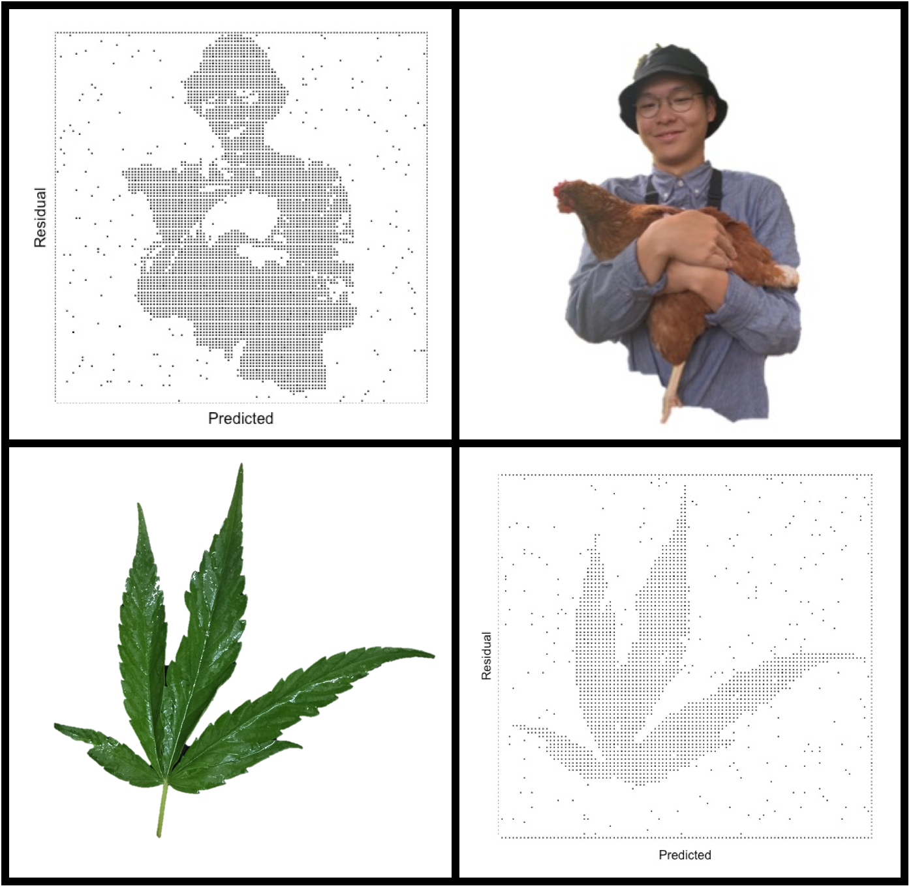

</a>

</a>

# -DeepLearning Course-

1.Handwritten Neural Network([Task](https://github.com/supermonk00/Deeplearning-VU-2020/blob/main/Handwritten%20model/Task.pdf))([Report]())

2.Auto Differentation([Task](https://github.com/supermonk00/Deeplearning-VU-2020/blob/main/Auto%20differentiation/Task.pdf))([Report]())

3.Convolutional Neural Network([Task](https://github.com/supermonk00/Deeplearning-VU-2020/blob/main/CNN/Task.pdf))([Report](https://github.com/supermonk00/Deeplearning-VU-2020/blob/main/CNN/Report.pdf))

4.Recurrent Neural Network([Task](https://github.com/supermonk00/Deeplearning-VU-2020/blob/main/RNN/Task.pdf))([Report](https://github.com/supermonk00/Deeplearning-VU-2020/blob/main/RNN/Report.pdf))

# -Tiny Side Project-

### Bar chart race (via [Flourish.studio](https://flourish.studio))

#####1. [Tomato Trial](https://preview.flourish.studio/2796245/ayQJ9jWAgFND7KjslUvAEj7jHr1aQQKd__Ydgukr5o2AWfSMa2TqfA2Titcu04pT/)：Harvest of tomatoes among four varieties

#####2. [COVID-19 in Caribean](https://preview.flourish.studio/2678801/5KAfvqHryXxiRyMzkyH1R72I0aCoN05ouW6fVZAKj-DIVIfeTxTMQzS_UYWSg1Km/)：Confirmed *COVD-19* cases acculuamted among Caribean countries

